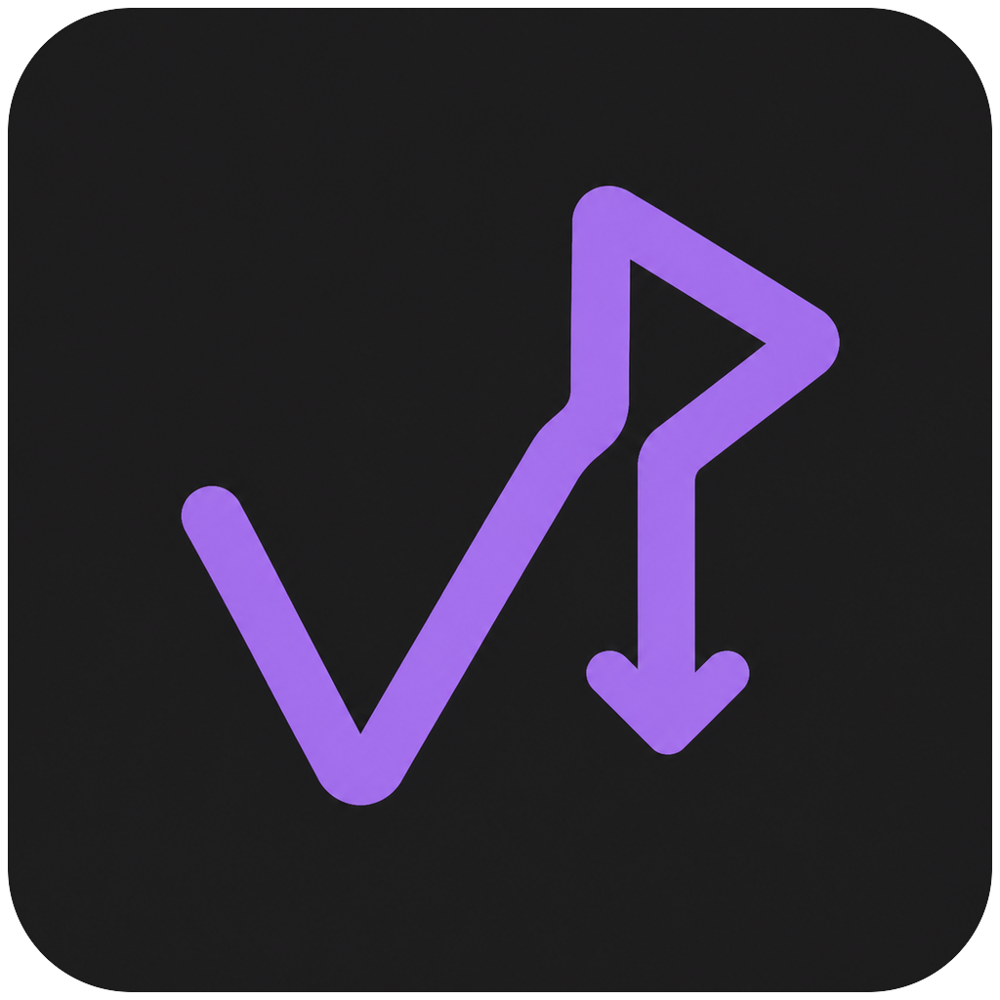
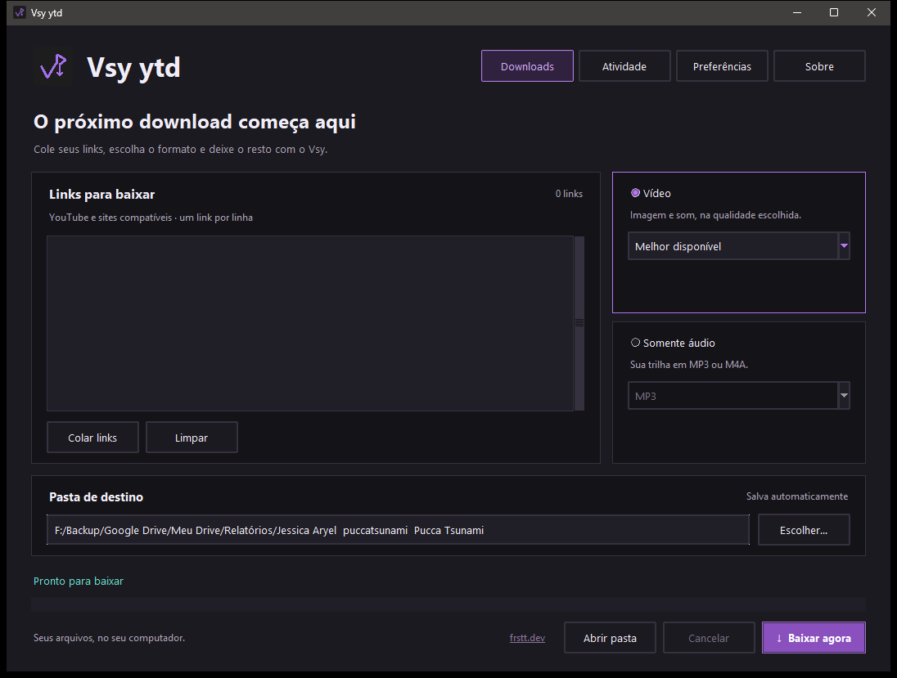

<p align="center">
  
</p>

<h1 align="center">Vsy ytd</h1>

<p align="center">
  Baixe vídeos e extraia áudios com uma interface elegante, rápida e totalmente local.
</p>

<p align="center">
  
  
  
  
</p>

<p align="center">
  <a href="https://github.com/frsttw/VStube/releases/latest/download/Vsy-ytd-Setup.exe"><strong>⬇ Baixar o Vsy ytd para Windows</strong></a>
</p>

<p align="center">
  
</p>

## Sobre

O **Vsy ytd** transforma o fluxo do `yt-dlp` e do FFmpeg em uma experiência visual simples. Cole um link, escolha vídeo ou áudio, defina a qualidade e faça o download sem abrir o terminal.

## Destaques

- Download de vídeos em até 4K.
- Extração de áudio em MP3 ou M4A.
- Compatibilidade com links individuais e playlists.
- Processamento de vários links, um por linha.
- Barra de progresso e cancelamento em tempo real.
- Memória automática da pasta, formato, qualidade e preferências.
- Histórico por pasta e formato para evitar baixar o mesmo vídeo duas vezes.
- Navegação por Downloads, Atividade, Preferências e Sobre.
- Interface escura com cartões, cores violeta/ciano e controles legíveis.
- Registro da sessão para acompanhar downloads e conversões.
- Cancelamento em segundo plano, incluindo processos de conversão.
- Instalador independente com todos os componentes necessários.

## Como usar

1. Baixe o `Vsy-ytd-Setup.exe` na página de Releases.
2. Execute o instalador e abra o Vsy ytd pelo atalho criado.
3. Cole um ou mais links, um por linha.
4. Escolha vídeo ou áudio e defina a qualidade.
5. Selecione a pasta de destino e clique em **Baixar agora** (ou Ctrl+Enter).

A aba **Preferências** permite baixar playlists inteiras e abrir a pasta ao concluir. Em **Atividade**, acompanhe o registro da sessão. O percentual se refere ao arquivo atual; vídeo e áudio podem ser baixados separadamente antes da junção.

> [!NOTE]
> O instalador ainda não possui assinatura digital. O Windows pode exibir um aviso do SmartScreen na primeira execução. O código-fonte está disponível neste repositório para auditoria.

## Tecnologias

| Camada | Tecnologia |
| --- | --- |
| Interface | Python + Tkinter/ttk |
| Downloads | yt-dlp |
| Áudio e vídeo | FFmpeg + FFprobe |
| Runtime auxiliar | Deno |
| Empacotamento | PyInstaller |
| Instalador | Inno Setup |

## Estrutura

```text
Vsy ytd/
├── app.py                 # Estado e coordenação da interface
├── interface.py           # Navegação, cartões e tema visual
├── engine.py              # Comandos, preferências e execução dos downloads
├── test_app.py            # Testes de comportamento e interface
├── test_media.py          # Integração com mídia sintética local
├── assets/                # Identidade visual
├── docs/                  # Imagens da documentação
├── VStube.spec            # Empacotamento do executável
├── installer.iss          # Configuração do instalador
└── build.ps1              # Build automatizado para Windows
```

## Compilar no Windows

Instale Python, PyInstaller, Inno Setup, yt-dlp, FFmpeg e Deno. Em seguida:

```powershell
.\build.ps1
```

O script reúne as ferramentas, gera `Vsy ytd.exe` e cria `Vsy-ytd-Setup.exe`.

Para executar os testes:

```powershell
python -m unittest test_app test_media -v
```

O teste de integração gera um vídeo sintético com FFmpeg e o serve apenas em localhost. Não baixa conteúdo do YouTube durante a validação.

## Privacidade

O Vsy ytd não mantém servidor próprio, conta de usuário ou telemetria. Para baixar arquivos, conecta-se aos sites dos links informados. Pasta, formato, qualidade e opções ficam salvos localmente; o registro de atividade permanece apenas na sessão e não é salvo em disco.

## Uso responsável

Use o Vsy ytd somente para conteúdo próprio, de domínio público ou que você tenha autorização para baixar. O aplicativo não contorna proteções nem acessa conteúdo privado.

---

<p align="center">Desenvolvido por <strong><a href="https://frstt.dev">frstt.dev</a></strong> · <a href="https://github.com/frsttw">@frsttw</a></p>
